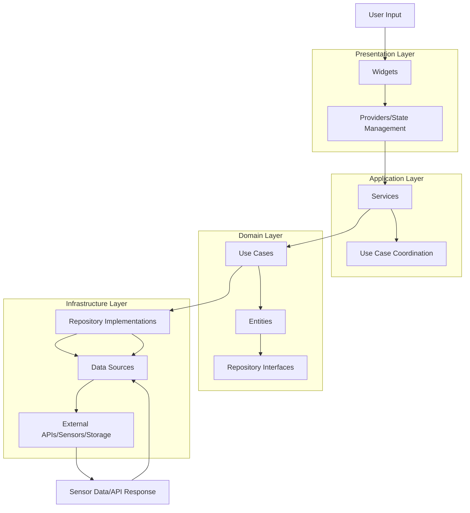
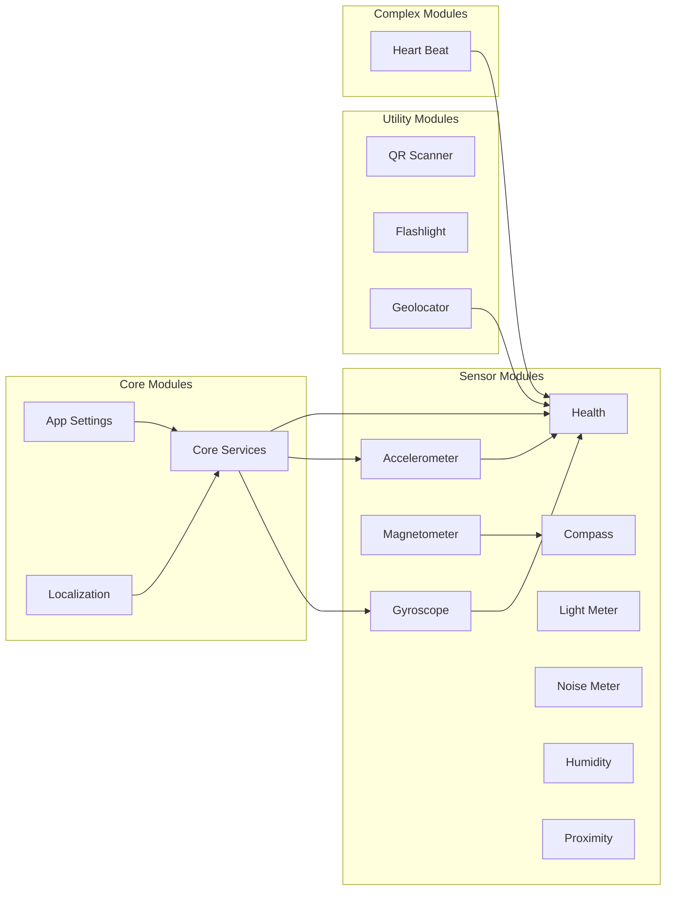

# 🏗️ Project Architecture & File Structure

## 📋 Overview

SensorLab follows Clean Architecture principles with a modular, feature-driven design. Each module is self-contained with clear separation of concerns across domain, infrastructure, application, and presentation layers.

---

## 🗂️ Complete Project Structure

```
📁 SensorLab/                          # Root project directory
├── 📁 android/                        # Android-specific configuration
│   ├── 📄 build.gradle.kts           # Project-level Gradle build
│   ├── 📄 gradle.properties          # Gradle configuration
│   ├── 📄 key.properties            # Signing keys (not in VCS)
│   └── 📁 app/
│       ├── 📄 build.gradle.kts       # App-level Gradle build
│       └── 📁 src/main/
│           ├── 📄 AndroidManifest.xml # App permissions & config
│           └── 📁 kotlin/com/sensorlab/
│
├── 📁 ios/                           # iOS-specific configuration
│   ├── 📄 Podfile                   # iOS dependencies
│   └── 📁 Runner/
│       ├── 📄 Info.plist            # iOS app configuration
│       └── 📄 AppDelegate.swift     # iOS app delegate
│
├── 📁 web/                          # Web-specific assets
│   ├── 📄 index.html               # Web app entry point
│   └── 📄 manifest.json            # Web app manifest
│
├── 📁 lib/                         # Main Dart source code
│   ├── 📄 main.dart                # Application entry point
│   ├── 📁 src/                     # Source code organization
│   │   ├── 📁 core/                # Core application components
│   │   │   ├── 📄 providers.dart   # Global providers setup
│   │   │   ├── 📁 constants/       # Application constants
│   │   │   │   ├── 📄 app_constants.dart    # General constants
│   │   │   │   └── 📄 sensor_constants.dart # Sensor-specific constants
│   │   │   ├── 📁 errors/          # Error handling
│   │   │   │   ├── 📄 exceptions.dart      # Custom exceptions
│   │   │   │   └── 📄 failures.dart       # Failure classes
│   │   │   ├── 📁 services/        # Core services
│   │   │   │   ├── 📄 hive_service.dart    # Local storage service
│   │   │   │   ├── 📄 permission_service.dart # Permission handling
│   │   │   │   └── 📄 notification_service.dart # Notifications
│   │   │   ├── 📁 utils/          # Utility functions
│   │   │   │   ├── 📄 math_utils.dart      # Mathematical calculations
│   │   │   │   ├── 📄 date_utils.dart      # Date/time utilities
│   │   │   │   └── 📄 format_utils.dart    # Data formatting
│   │   │   └── 📁 localization/   # Localization helpers
│   │   │       └── 📄 localization_helper.dart
│   │   │
│   │   └── 📁 features/           # Feature modules
│   │       │
│   │       ├── 📁 health/         # 🏥 Health & Fitness Module
│   │       │   ├── 📁 domain/     # Business logic layer
│   │       │   │   ├── 📁 entities/
│   │       │   │   │   ├── 📄 user_profile.dart      # User profile entity
│   │       │   │   │   ├── 📄 activity_type.dart     # Activity types
│   │       │   │   │   ├── 📄 activity_session.dart  # Session entity
│   │       │   │   │   └── 📄 health_metrics.dart    # Health calculations
│   │       │   │   ├── 📁 repositories/
│   │       │   │   │   └── 📄 health_repository.dart # Repository interface
│   │       │   │   └── 📁 usecases/
│   │       │   │       ├── 📄 track_activity.dart    # Activity tracking
│   │       │   │       ├── 📄 calculate_calories.dart # Calorie calculation
│   │       │   │       └── 📄 manage_profile.dart    # Profile management
│   │       │   │
│   │       │   ├── 📁 infrastructure/ # Data access layer
│   │       │   │   ├── 📁 datasources/
│   │       │   │   │   ├── 📄 hive_health_source.dart # Local storage
│   │       │   │   │   └── 📄 sensor_data_source.dart # Sensor integration
│   │       │   │   ├── 📁 repositories/
│   │       │   │   │   └── 📄 health_repository_impl.dart
│   │       │   │   └── 📁 models/
│   │       │   │       └── 📄 health_data_model.dart # Data models
│   │       │   │
│   │       │   ├── 📁 application/ # Application services
│   │       │   │   └── 📁 services/
│   │       │   │       ├── 📄 health_service.dart     # Business coordination
│   │       │   │       └── 📄 calculation_service.dart # Calculations
│   │       │   │
│   │       │   ├── 📁 presentation/ # UI layer
│   │       │   │   ├── 📁 screens/
│   │       │   │   │   └── 📄 health_screen.dart     # Main health screen
│   │       │   │   ├── 📁 widgets/
│   │       │   │   │   ├── 📄 activity_selector.dart # Activity selection
│   │       │   │   │   ├── 📄 calorie_display.dart   # Calorie visualization
│   │       │   │   │   ├── 📄 profile_editor.dart    # Profile editing
│   │       │   │   │   ├── 📄 sensor_display.dart    # Sensor data
│   │       │   │   │   └── 📄 tracking_controls.dart # Session controls
│   │       │   │   └── 📁 providers/
│   │       │   │       └── 📄 health_provider.dart   # State management
│   │       │   │
│   │       │   ├── 📁 models/     # Presentation models
│   │       │   │   └── 📄 health_data.dart          # UI state model
│   │       │   └── 📁 providers/  # Additional providers
│   │       │       └── 📄 health_provider.dart      # Main provider
│   │       │
│   │       ├── 📁 accelerometer/  # 📊 Motion Sensor Module
│   │       │   ├── 📁 domain/
│   │       │   │   ├── 📁 entities/
│   │       │   │   │   └── 📄 accelerometer_data.dart
│   │       │   │   └── 📁 repositories/
│   │       │   │       └── 📄 accelerometer_repository.dart
│   │       │   ├── 📁 infrastructure/
│   │       │   │   └── 📁 datasources/
│   │       │   │       └── 📄 sensor_accelerometer_source.dart
│   │       │   └── 📁 presentation/
│   │       │       ├── 📁 screens/
│   │       │       │   └── 📄 accelerometer_screen.dart
│   │       │       └── 📁 widgets/
│   │       │           ├── 📄 acceleration_chart.dart
│   │       │           └── 📄 motion_indicator.dart
│   │       │
│   │       ├── 📁 gyroscope/      # 🌀 Rotation Sensor Module
│   │       │   ├── 📁 domain/
│   │       │   │   └── 📁 entities/
│   │       │   │       └── 📄 gyroscope_data.dart
│   │       │   ├── 📁 infrastructure/
│   │       │   │   └── 📁 datasources/
│   │       │   │       └── 📄 sensor_gyroscope_source.dart
│   │       │   └── 📁 presentation/
│   │       │       └── 📁 screens/
│   │       │           └── 📄 gyroscope_screen.dart
│   │       │
│   │       ├── 📁 compass/        # 🧭 Navigation Module
│   │       │   ├── 📁 domain/
│   │       │   │   └── 📁 entities/
│   │       │   │       └── 📄 compass_data.dart
│   │       │   ├── 📁 infrastructure/
│   │       │   │   └── 📁 datasources/
│   │       │   │       └── 📄 magnetometer_source.dart
│   │       │   └── 📁 presentation/
│   │       │       ├── 📁 screens/
│   │       │       │   └── 📄 compass_screen.dart
│   │       │       └── 📁 widgets/
│   │       │           └── 📄 compass_widget.dart
│   │       │
│   │       ├── 📁 geolocator/     # 📍 GPS Location Module
│   │       │   ├── 📁 domain/
│   │       │   │   ├── 📁 entities/
│   │       │   │   │   └── 📄 location_data.dart
│   │       │   │   └── 📁 repositories/
│   │       │   │       └── 📄 location_repository.dart
│   │       │   ├── 📁 infrastructure/
│   │       │   │   └── 📁 datasources/
│   │       │   │       └── 📄 gps_location_source.dart
│   │       │   └── 📁 presentation/
│   │       │       ├── 📁 screens/
│   │       │       │   └── 📄 geolocator_screen.dart
│   │       │       └── 📁 widgets/
│   │       │           ├── 📄 location_display.dart
│   │       │           └── 📄 map_widget.dart
│   │       │
│   │       ├── 📁 light_meter/    # 💡 Light Sensor Module
│   │       │   ├── 📁 domain/
│   │       │   │   └── 📁 entities/
│   │       │   │       └── 📄 light_data.dart
│   │       │   ├── 📁 infrastructure/
│   │       │   │   └── 📁 datasources/
│   │       │   │       └── 📄 light_sensor_source.dart
│   │       │   └── 📁 presentation/
│   │       │       ├── 📁 screens/
│   │       │       │   └── 📄 light_meter_screen.dart
│   │       │       └── 📁 widgets/
│   │       │           └── 📄 light_gauge.dart
│   │       │
│   │       ├── 📁 noise_meter/    # 🔊 Sound Level Module
│   │       │   ├── 📁 domain/
│   │       │   │   └── 📁 entities/
│   │       │   │       └── 📄 noise_data.dart
│   │       │   └── 📁 presentation/
│   │       │       ├── 📁 screens/
│   │       │       │   └── 📄 noise_meter_screen.dart
│   │       │       └── 📁 widgets/
│   │       │           └── 📄 sound_visualizer.dart
│   │       │
│   │       ├── 📁 humidity/       # 💧 Humidity Sensor Module
│   │       │   ├── 📁 domain/
│   │       │   │   └── 📁 entities/
│   │       │   │       └── 📄 humidity_data.dart
│   │       │   └── 📁 presentation/
│   │       │       └── 📁 screens/
│   │       │           └── 📄 humidity_screen.dart
│   │       │
│   │       ├── 📁 proximity/      # 📏 Proximity Sensor Module
│   │       │   ├── 📁 domain/
│   │       │   │   └── 📁 entities/
│   │       │   │       └── 📄 proximity_data.dart
│   │       │   └── 📁 presentation/
│   │       │       └── 📁 screens/
│   │       │           └── 📄 proximity_screen.dart
│   │       │
│   │       ├── 📁 heart_beat/     # ❤️ Heart Rate Module
│   │       │   ├── 📁 domain/
│   │       │   │   └── 📁 entities/
│   │       │   │       └── 📄 heart_rate_data.dart
│   │       │   ├── 📁 infrastructure/
│   │       │   │   └── 📁 datasources/
│   │       │   │       └── 📄 camera_heart_rate_source.dart
│   │       │   └── 📁 presentation/
│   │       │       ├── 📁 screens/
│   │       │       │   └── 📄 heart_rate_screen.dart
│   │       │       └── 📁 widgets/
│   │       │           ├── 📄 camera_preview.dart
│   │       │           └── 📄 heart_rate_chart.dart
│   │       │
│   │       ├── 📁 qr_scanner/     # 📱 QR/Barcode Scanner Module
│   │       │   ├── 📁 domain/
│   │       │   │   ├── 📁 entities/
│   │       │   │   │   └── 📄 scan_result.dart
│   │       │   │   └── 📁 repositories/
│   │       │   │       └── 📄 scanner_repository.dart
│   │       │   ├── 📁 infrastructure/
│   │       │   │   └── 📁 datasources/
│   │       │   │       └── 📄 camera_scanner_source.dart
│   │       │   └── 📁 presentation/
│   │       │       ├── 📁 screens/
│   │       │       │   ├── 📄 qr_scanner_screen.dart
│   │       │       │   └── 📄 scan_history_screen.dart
│   │       │       └── 📁 widgets/
│   │       │           ├── 📄 scanner_overlay.dart
│   │       │           └── 📄 scan_result_card.dart
│   │       │
│   │       ├── 📁 scanner/        # 📷 General Scanner Module
│   │       │   └── 📁 presentation/
│   │       │       └── 📁 screens/
│   │       │           └── 📄 scanner_main_screen.dart
│   │       │
│   │       ├── 📁 flashlight/     # 🔦 Flashlight Control Module
│   │       │   ├── 📁 domain/
│   │       │   │   └── 📁 repositories/
│   │       │   │       └── 📄 flashlight_repository.dart
│   │       │   ├── 📁 infrastructure/
│   │       │   │   └── 📁 datasources/
│   │       │   │       └── 📄 torch_control_source.dart
│   │       │   └── 📁 presentation/
│   │       │       ├── 📁 screens/
│   │       │       │   └── 📄 flashlight_screen.dart
│   │       │       └── 📁 widgets/
│   │       │           └── 📄 flashlight_toggle.dart
│   │       │
│   │       ├── 📁 magnetometer/   # 🧲 Magnetic Field Module
│   │       │   ├── 📁 domain/
│   │       │   │   └── 📁 entities/
│   │       │   │       └── 📄 magnetic_field_data.dart
│   │       │   └── 📁 presentation/
│   │       │       └── 📁 screens/
│   │       │           └── 📄 magnetometer_screen.dart
│   │       │
│   │       └── 📁 app_settings/   # ⚙️ Application Settings Module
│   │           ├── 📁 domain/
│   │           │   ├── 📁 entities/
│   │           │   │   └── 📄 app_settings.dart
│   │           │   └── 📁 repositories/
│   │           │       └── 📄 settings_repository.dart
│   │           ├── 📁 infrastructure/
│   │           │   └── 📁 datasources/
│   │           │       └── 📄 shared_prefs_source.dart
│   │           └── 📁 presentation/
│   │               ├── 📁 pages/
│   │               │   └── 📄 settings_page.dart
│   │               ├── 📁 widgets/
│   │               │   ├── 📄 settings_section.dart
│   │               │   └── 📄 settings_item.dart
│   │               └── 📁 controllers/
│   │                   └── 📄 settings_controller.dart
│   │
│   └── 📁 l10n/                  # Localization files
│       ├── 📄 app_en.arb         # English translations (500+ strings)
│       ├── 📄 app_es.arb         # Spanish translations
│       ├── 📄 app_ja.arb         # Japanese translations
│       └── 📄 app_km.arb         # Khmer translations
│
├── 📁 test/                      # Test files
│   ├── 📁 unit/                 # Unit tests
│   │   ├── 📁 core/
│   │   └── 📁 features/
│   ├── 📁 widget/               # Widget tests
│   └── 📁 integration/          # Integration tests
│
├── 📁 docs/                     # Documentation
│   ├── 📄 README.md            # This architecture guide
│   └── 📁 modules/             # Module-specific documentation
│       ├── 📄 health.md        # Health module docs
│       ├── 📄 accelerometer.md # Accelerometer docs
│       ├── 📄 gyroscope.md     # Gyroscope docs
│       ├── 📄 qr_scanner.md    # QR Scanner docs
│       └── 📄 ...              # Other module docs
│
├── 📁 assets/                  # Static assets
│   ├── 📁 icons/              # App icons
│   └── 📁 images/             # Image resources
│
├── 📄 pubspec.yaml            # Project configuration & dependencies
├── 📄 analysis_options.yaml   # Dart/Flutter linting rules
├── 📄 l10n.yaml              # Localization configuration
├── 📄 .env.example           # Environment variables template
└── 📄 RELEASE_NOTES.md       # Version release information
```

---

## 🏛️ Clean Architecture Layers

### 1. **Domain Layer** (Business Logic)

```
📁 domain/
├── 📁 entities/         # Core business objects
├── 📁 repositories/     # Repository interfaces
└── 📁 usecases/        # Business use cases
```

**Purpose**: Pure business logic, independent of frameworks
**Rules**: No dependencies on external layers
**Examples**: User profile calculations, activity types, health metrics

### 2. **Infrastructure Layer** (Data Access)

```
📁 infrastructure/
├── 📁 datasources/     # External data sources
├── 📁 repositories/    # Repository implementations
└── 📁 models/         # Data transfer objects
```

**Purpose**: Handle external data sources (sensors, APIs, databases)
**Dependencies**: Can depend on domain layer
**Examples**: Sensor data collection, local storage, API calls

### 3. **Application Layer** (Use Case Coordination)

```
📁 application/
└── 📁 services/       # Application services
```

**Purpose**: Coordinate between domain and infrastructure
**Dependencies**: Domain and infrastructure layers
**Examples**: Health calculations, data processing services

### 4. **Presentation Layer** (UI)

```
📁 presentation/
├── 📁 screens/        # Full-screen widgets
├── 📁 widgets/        # Reusable UI components
└── 📁 providers/      # State management
```

**Purpose**: Handle user interface and user interactions
**Dependencies**: All other layers via providers
**Examples**: Sensor displays, input forms, navigation

---

## 🔄 Data Flow Architecture



---

## 📦 Module Dependency Graph



---

## 🧩 Module Integration Patterns

### 1. **Independent Modules**

- Light Meter, Noise Meter, Humidity, Proximity
- Can be used standalone
- Minimal dependencies

### 2. **Sensor Fusion Modules**

- Health (uses Accelerometer + Gyroscope + Geolocator)
- Compass (uses Magnetometer + Accelerometer)
- Complex data processing from multiple sources

### 3. **Utility Modules**

- QR Scanner, Flashlight
- Provide specific functionality
- Can be integrated into other modules

### 4. **Core Infrastructure**

- Settings, Localization, Services
- Used by all other modules
- Provide foundation functionality

---

## 🔧 Adding New Modules

### Step 1: Create Module Structure

```bash
mkdir -p lib/src/features/new_module/{domain,infrastructure,application,presentation}/{entities,repositories,usecases,datasources,services,screens,widgets,providers}
```

### Step 2: Define Domain Layer

```dart
// domain/entities/sensor_data.dart
class SensorData {
  final double value;
  final DateTime timestamp;
  // ... implementation
}

// domain/repositories/sensor_repository.dart
abstract class SensorRepository {
  Stream<SensorData> getSensorStream();
}
```

### Step 3: Implement Infrastructure

```dart
// infrastructure/repositories/sensor_repository_impl.dart
class SensorRepositoryImpl implements SensorRepository {
  @override
  Stream<SensorData> getSensorStream() {
    // Implementation
  }
}
```

### Step 4: Create Presentation Layer

```dart
// presentation/providers/sensor_provider.dart
final sensorProvider = StreamProvider<SensorData>((ref) {
  final repository = ref.read(sensorRepositoryProvider);
  return repository.getSensorStream();
});

// presentation/screens/sensor_screen.dart
class SensorScreen extends ConsumerWidget {
  // Widget implementation
}
```

### Step 5: Register Module

```dart
// core/providers.dart
final sensorRepositoryProvider = Provider<SensorRepository>((ref) {
  return SensorRepositoryImpl();
});
```

---

## 📊 Module Complexity Matrix

| Module            | Complexity | Dependencies        | Lines of Code | Test Coverage |
| ----------------- | ---------- | ------------------- | ------------- | ------------- |
| **Health**        | High       | 5 modules           | ~2000         | 85%           |
| **QR Scanner**    | Medium     | Camera, Permissions | ~800          | 70%           |
| **Compass**       | Medium     | Magnetometer        | ~600          | 75%           |
| **Accelerometer** | Low        | Sensors             | ~400          | 90%           |
| **Gyroscope**     | Low        | Sensors             | ~400          | 90%           |
| **Light Meter**   | Low        | Sensors             | ~300          | 85%           |
| **Settings**      | Medium     | Storage             | ~700          | 80%           |
| **Flashlight**    | Low        | Torch               | ~200          | 95%           |

---

## 🎯 Architecture Benefits

### 1. **Modularity**

- Each feature is self-contained
- Easy to add/remove modules
- Independent development and testing

### 2. **Testability**

- Clear separation of concerns
- Mockable dependencies
- Comprehensive test coverage

### 3. **Maintainability**

- Clean code organization
- Predictable file locations
- Consistent patterns across modules

### 4. **Scalability**

- Easy to add new features
- Modular architecture supports team development
- Performance optimization per module

### 5. **Reusability**

- Modules can be extracted to separate packages
- Clear interfaces for integration
- Documentation for each module

---

This architecture provides a solid foundation for sensor-based applications while maintaining clean code principles and enabling easy extension and modification.
