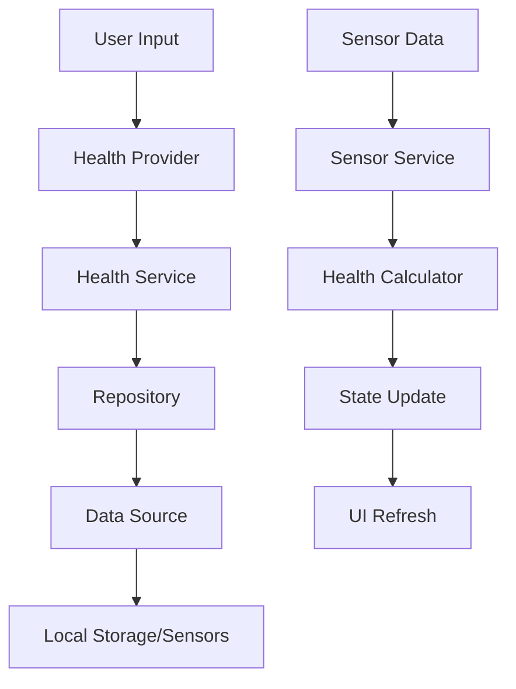

# 🏥 Health Module Documentation

## Overview

The Health module is a comprehensive health and fitness tracking system that provides activity monitoring, calorie calculation, and health metrics visualization. Built using Clean Architecture principles, it offers a robust foundation for health-related features.

---

## 🎯 Features

### Core Functionality

- **Activity Tracking**: Monitor various physical activities (walking, running, cycling, etc.)
- **Calorie Calculation**: Real-time calorie burn estimation based on user profile and activity
- **Session Management**: Start, pause, stop, and reset tracking sessions
- **Health Metrics**: BMI, BMR calculations and health indicators
- **User Profile Management**: Comprehensive user profile with physical measurements

### Supported Activities

- 🚶 **Walking**: General walking activity
- 🏃 **Running**: Running and jogging activities
- 🚴 **Cycling**: Bicycle riding activities
- 🪑 **Sitting**: Sedentary activities
- 🧍 **Standing**: Standing activities
- 🪜 **Stairs**: Stair climbing activities
- 💪 **Workout**: General workout and exercise

---

## 🏗️ Module Architecture

```
📁 health/
├── 📁 domain/                      # Business Logic Layer
│   ├── 📁 entities/
│   │   ├── user_profile.dart       # User profile entity
│   │   ├── activity_type.dart      # Activity types enum
│   │   ├── activity_session.dart   # Activity session entity
│   │   └── health_metrics.dart     # Health calculations
│   ├── 📁 repositories/
│   │   └── health_repository.dart  # Repository interface
│   └── 📁 usecases/
│       ├── track_activity.dart     # Activity tracking use case
│       ├── calculate_calories.dart # Calorie calculation
│       └── manage_profile.dart     # Profile management
│
├── 📁 infrastructure/              # Data Layer
│   ├── 📁 datasources/
│   │   ├── hive_health_source.dart # Local storage
│   │   └── sensor_data_source.dart # Sensor integration
│   ├── 📁 repositories/
│   │   └── health_repository_impl.dart
│   └── 📁 models/
│       └── health_data_model.dart  # Data transfer objects
│
├── 📁 application/                 # Application Services
│   └── 📁 services/
│       ├── health_service.dart     # Business logic coordination
│       └── calculation_service.dart # Health calculations
│
├── 📁 presentation/                # UI Layer
│   ├── 📁 screens/
│   │   └── health_screen.dart      # Main health screen
│   ├── 📁 widgets/
│   │   ├── activity_selector.dart  # Activity selection
│   │   ├── calorie_display.dart    # Calorie visualization
│   │   ├── profile_editor.dart     # Profile editing modal
│   │   ├── sensor_display.dart     # Sensor data display
│   │   └── tracking_controls.dart  # Session controls
│   └── 📁 providers/
│       └── health_provider.dart    # State management
│
├── 📁 models/                      # Presentation Models
│   └── health_data.dart           # UI state model
│
└── 📁 providers/
    └── health_provider.dart       # Riverpod state provider
```

---

## 📋 Integration Guide

### 1. Adding Health Module to Your Project

#### Dependencies Required

```yaml
dependencies:
  # State Management
  flutter_riverpod: ^2.4.9

  # Sensors
  sensors_plus: ^4.0.2
  pedometer: ^4.0.2

  # Local Storage
  hive: ^2.2.3
  hive_flutter: ^1.1.0

  # Permissions
  permission_handler: ^11.1.0

dev_dependencies:
  # Code Generation
  hive_generator: ^2.0.1
  build_runner: ^2.4.7
```

#### File Structure Setup

```bash
# Create the module directory structure
mkdir -p lib/src/features/health/{domain,infrastructure,application,presentation}/{entities,repositories,usecases,datasources,services,screens,widgets,providers}
```

### 2. Core Implementation

#### User Profile Entity

```dart
// domain/entities/user_profile.dart
@HiveType(typeId: 1)
class UserProfile {
  @HiveField(0)
  final String id;

  @HiveField(1)
  final String name;

  @HiveField(2)
  final int age;

  @HiveField(3)
  final double weight; // kg

  @HiveField(4)
  final double height; // cm

  @HiveField(5)
  final Gender gender;

  const UserProfile({
    required this.id,
    required this.name,
    required this.age,
    required this.weight,
    required this.height,
    required this.gender,
  });

  // BMI Calculation
  double get bmi => weight / ((height / 100) * (height / 100));

  // BMR Calculation (Harris-Benedict Equation)
  double get bmr {
    final baseRate = gender == Gender.male
        ? 88.362 + (13.397 * weight) + (4.799 * height) - (5.677 * age)
        : 447.593 + (9.247 * weight) + (3.098 * height) - (4.330 * age);
    return baseRate;
  }
}

@HiveType(typeId: 2)
enum Gender {
  @HiveField(0)
  male,
  @HiveField(1)
  female,
}
```

#### Activity Type Entity

```dart
// domain/entities/activity_type.dart
enum ActivityType {
  walking,
  running,
  cycling,
  sitting,
  standing,
  stairs,
  workout;

  // MET (Metabolic Equivalent) values for calorie calculation
  double get metValue {
    switch (this) {
      case ActivityType.walking:
        return 3.5;
      case ActivityType.running:
        return 8.0;
      case ActivityType.cycling:
        return 6.0;
      case ActivityType.sitting:
        return 1.2;
      case ActivityType.standing:
        return 1.8;
      case ActivityType.stairs:
        return 8.5;
      case ActivityType.workout:
        return 5.5;
    }
  }
}
```

#### Health Provider

```dart
// providers/health_provider.dart
final healthProvider = StateNotifierProvider<HealthNotifier, HealthData>((ref) {
  return HealthNotifier();
});

class HealthNotifier extends StateNotifier<HealthData> {
  HealthNotifier() : super(HealthData.initial()) {
    _initialize();
  }

  void _initialize() {
    // Initialize sensors, load user profile, etc.
  }

  void startTracking() {
    state = state.copyWith(
      sessionState: HealthSessionState.tracking,
      sessionStartTime: DateTime.now(),
    );
  }

  void pauseTracking() {
    state = state.copyWith(
      sessionState: HealthSessionState.paused,
    );
  }

  void stopTracking() {
    state = state.copyWith(
      sessionState: HealthSessionState.idle,
    );
  }

  void updateProfile(UserProfile profile) {
    state = state.copyWith(profile: profile);
    // Save to local storage
  }

  void selectActivity(ActivityType activity) {
    state = state.copyWith(selectedActivity: activity);
  }
}
```

### 3. UI Integration

#### Health Screen

```dart
// presentation/screens/health_screen.dart
class HealthScreen extends ConsumerWidget {
  @override
  Widget build(BuildContext context, WidgetRef ref) {
    final healthData = ref.watch(healthProvider);

    return Scaffold(
      appBar: AppBar(
        title: Text(l10n.healthTitle),
      ),
      body: SingleChildScrollView(
        padding: const EdgeInsets.all(16),
        child: Column(
          children: [
            _buildUserProfile(healthData),
            const SizedBox(height: 16),
            _buildQuickStats(healthData),
            const SizedBox(height: 16),
            _buildActivitySelector(healthData),
            const SizedBox(height: 16),
            _buildTrackingControls(healthData),
            const SizedBox(height: 16),
            _buildCalorieDisplay(healthData),
          ],
        ),
      ),
    );
  }
}
```

#### Profile Editor Modal

```dart
// presentation/widgets/profile_editor.dart
class ProfileEditor extends ConsumerStatefulWidget {
  static Future<void> show(BuildContext context, UserProfile profile) {
    return showModalBottomSheet(
      context: context,
      isScrollControlled: true,
      backgroundColor: Colors.transparent,
      builder: (context) => ProfileEditor(profile: profile),
    );
  }
}
```

---

## 🔧 Customization Options

### 1. Activity Types

Add new activity types by extending the enum:

```dart
enum ActivityType {
  // ... existing activities
  swimming,
  yoga,
  hiking;

  double get metValue {
    switch (this) {
      // ... existing cases
      case ActivityType.swimming:
        return 6.0;
      case ActivityType.yoga:
        return 2.5;
      case ActivityType.hiking:
        return 6.0;
    }
  }
}
```

### 2. Calorie Calculation

Customize the calorie calculation algorithm:

```dart
class CalorieCalculator {
  static double calculateCalories({
    required ActivityType activity,
    required UserProfile profile,
    required Duration duration,
  }) {
    // Calories = MET × weight(kg) × time(hours)
    final met = activity.metValue;
    final weightKg = profile.weight;
    final hours = duration.inMinutes / 60.0;

    return met * weightKg * hours;
  }
}
```

### 3. Health Metrics

Add custom health metrics:

```dart
extension HealthMetrics on UserProfile {
  double get bodyFatPercentage {
    // Implementation for body fat calculation
  }

  String get bmiCategory {
    if (bmi < 18.5) return 'Underweight';
    if (bmi < 25) return 'Normal';
    if (bmi < 30) return 'Overweight';
    return 'Obese';
  }
}
```

---

## 📊 Data Flow



---

## 🧪 Testing

### Unit Tests

```dart
// test/health/domain/entities/user_profile_test.dart
void main() {
  group('UserProfile', () {
    test('should calculate BMI correctly', () {
      final profile = UserProfile(
        id: '1',
        name: 'Test User',
        age: 25,
        weight: 70.0,
        height: 175.0,
        gender: Gender.male,
      );

      expect(profile.bmi, closeTo(22.86, 0.01));
    });
  });
}
```

### Widget Tests

```dart
// test/health/presentation/widgets/calorie_display_test.dart
void main() {
  testWidgets('CalorieDisplay shows correct calories', (tester) async {
    await tester.pumpWidget(
      MaterialApp(
        home: CalorieDisplay(
          calories: 150.0,
          activity: ActivityType.walking,
        ),
      ),
    );

    expect(find.text('150.0 kcal'), findsOneWidget);
  });
}
```

---

## 📱 Usage Examples

### Basic Implementation

```dart
// In your main app
void main() {
  runApp(
    ProviderScope(
      child: MyApp(),
    ),
  );
}

class MyApp extends ConsumerWidget {
  @override
  Widget build(BuildContext context, WidgetRef ref) {
    return MaterialApp(
      home: HealthScreen(),
    );
  }
}
```

### Accessing Health Data

```dart
// In any widget
class MyWidget extends ConsumerWidget {
  @override
  Widget build(BuildContext context, WidgetRef ref) {
    final healthData = ref.watch(healthProvider);

    return Text('Calories: ${healthData.caloriesBurned}');
  }
}
```

---

## 🔗 Related Modules

- **Accelerometer**: Provides motion data for activity detection
- **Gyroscope**: Assists in movement pattern recognition
- **Geolocator**: GPS data for distance and route tracking
- **Settings**: User preferences and configuration

---

## 🐛 Troubleshooting

### Common Issues

1. **Sensor Data Not Available**

   ```dart
   // Check sensor availability
   if (await Sensors.accelerometerAvailable()) {
     // Use accelerometer
   }
   ```

2. **Calorie Calculation Issues**

   ```dart
   // Validate user profile data
   if (profile.weight > 0 && profile.height > 0) {
     // Perform calculations
   }
   ```

3. **State Management Issues**
   ```dart
   // Ensure provider is properly scoped
   ProviderScope(
     child: YourApp(),
   )
   ```

---

## 📈 Performance Considerations

- **Sensor Sampling**: Limit sensor data frequency to preserve battery
- **Local Storage**: Use Hive for efficient local data persistence
- **Memory Management**: Properly dispose of streams and controllers
- **Background Processing**: Implement proper lifecycle management

---

## 🚀 Future Enhancements

- Heart rate integration via camera
- GPS-based distance tracking
- Sleep pattern monitoring
- Nutrition tracking integration
- Social features and challenges
- Export data functionality
- Advanced analytics and insights

---

This module provides a solid foundation for health and fitness tracking in Flutter applications, with clean architecture, comprehensive testing, and extensive customization options.
